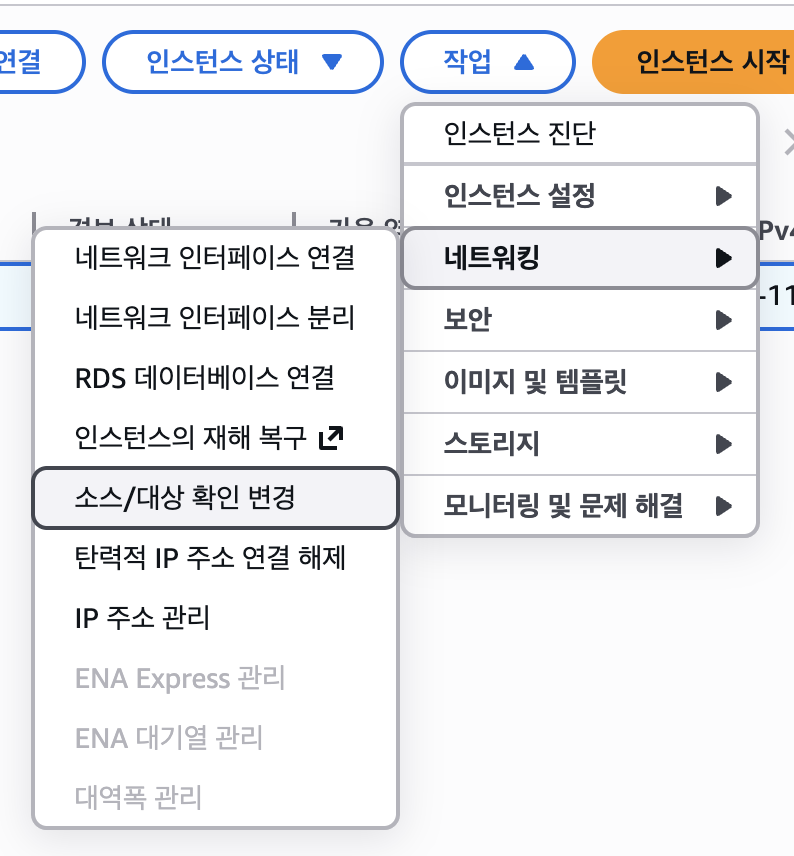
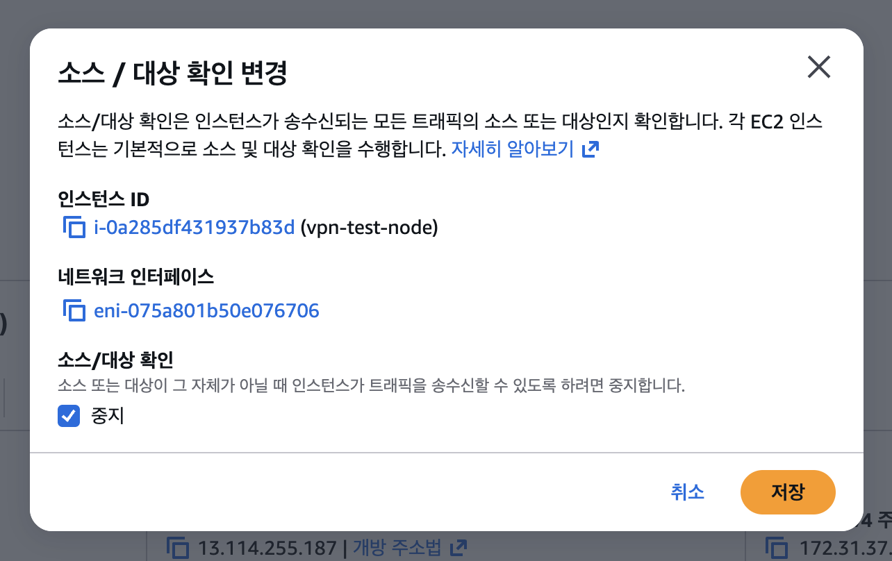
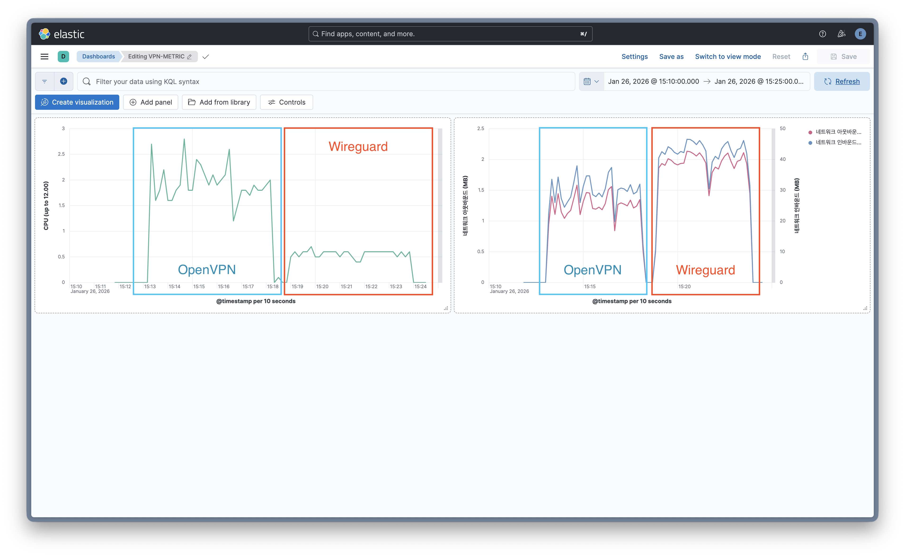

# WireGuard vs OpenVPN: A Comprehensive Benchmark on Performance, Efficiency, and Quality

**Comparative analysis of VPN protocols in a cross-region hybrid cloud using iperf3 (Throughput), Metricbeat (CPU Efficiency), and MTR (Network Quality).**

## 0. Index

1. **[Overview](#1-overview)**
2. **[Test Environment](#2-test-environment)**
3. **[Project Structure](#3-project-structure)**
4. **[Local Server Setup](#4-local-server-setup-hub-node)**
5. **[EC2 Instance Setup](#5-ec2-instance-setup-client-node)**
6. **[Configuration Reference](#6-configuration-reference-conf)**
7. **[Performance Test Methodology](#7-performance-test-methodology)**
8. **[Experimental Findings](#8-experimental-findings-summary)**
9. **[Discussion](#9-discussion-omitted)**

## 1. Overview

### 1.1 Purpose

Woori FISA 세미나를 위해 진행한 WireGuard와 OpenVPN의 성능 비교 실험 기록입니다.

AWS (Cloud)와 홈 서버 (On-Premise)를 연결하는 하이브리드 환경에서 각 VPN의 효율성을 정량적으로 확인하고, 인프라 설계에 필요한 공학적 근거를 마련하고자 합니다.

> 📘 **How to Read This Document**
>
> * **비전공자 / 세미나 청자:** 1 → 2 → 7 → 8 장 위주로 읽으시면 실험 의도와 결과를 이해할 수 있습니다.
> * **엔지니어 / 재현 목적:** 3 ~ 6 장을 순서대로 따라가면 동일 환경 재현이 가능합니다.
> * **모든 설정 값은 실제 실험에 사용된 값이며**, 생략 없이 기록되었습니다.

### 1.2 Scope

단순한 연결 테스트를 넘어 실제 운영 환경에서의 효율을 확인하기 위해 다음 항목에 집중합니다.

* **네트워크 성능:** iperf3를 활용한 대역폭 및 패킷 재전송 빈도 측정

* **리소스 효율성:** ELK Stack (Metricbeat)을 이용한 커널 및 유저 영역의 CPU 부하 모니터링

* **환경 재현성:** 실험에 사용한 Docker 설정과 자동화 스크립트 공유

### 1.3 Practical Application

세미나 시간 관계상 생략된 상세 구축 과정과 트러블슈팅 사례를 보완하는 레퍼런스 가이드입니다.

하이브리드 클라우드 네트워크를 설계하거나 실무에 VPN 도입을 고민하는 엔지니어분들께 기술 참조 문서로 활용되길 바랍니다.

## 2. Test Environment

|  | **Server Side (Hub)** |  **Client Side (Spoke)** |
| --- | --- | --- |
| **Location** | Seoul, South Korea | Tokyo, Japan (AWS) | 
| **Hardware** | Intel Core i5-12400 / 32GB RAM | AWS t2.micro (Burstable) | 
| **OS** | Debian 13 (Trixie) | Amazon Linux 2023 | 
| **Kernel** | 6.14.11-5-pve (Proxmox VE custom kernel) | Kernel 6.12 | 
| **Network** | 500 Mbps Symmetrical (SK Broadband) | AWS Global Backbone | 

## 3. Project Structure

전체적인 실험 환경의 디렉터리 구조입니다. 서비스별로 설정을 분리하여 관리하며, Docker Compose를 통해 모든 인프라를 논리적으로 연결하고 한 번에 제어할 수 있도록 구성했습니다.

* **Hub (On-premise)**

    ```Plain text
    vpn-perf-bench/
    ├── metricbeat/
    │   └── metricbeat.yml            # 컨테이너 자원(CPU, Network) 수집 및 ES 전송 설정
    ├── openvpn/
    │   ├── data/
    │   │   ├── ca.crt                # 모든 노드의 신뢰 기반이 되는 루트 인증서
    │   │   ├── dh.pem                # 완전 순방향 비밀성(PFS)을 위한 Diffie-Hellman 파라미터
    │   │   ├── server.conf           # Hub 노드 운영을 위한 메인 설정 파일
    │   │   ├── server.crt            # CA로부터 발급받은 서버 인증서
    │   │   ├── server.key            # 서버 개인키
    │   │   └── ta.key                # TLS 핸드쉐이크 보호를 위한 HMAC 공유 비밀키
    │   └── Dockerfile                # OpenVPN 패키지 설치 및 커스텀 환경 구성
    ├── wireguard/
    │   ├── data/
    │   │   ├── client.conf           # Spoke(EC2) 접속을 위한 클라이언트 템플릿 (키 포함)
    │   │   └── wg0.conf              # Hub 인터페이스(wg0) 정의 및 NAT 포워딩 설정
    │   └── Dockerfile                # WireGuard 모듈 연동 및 네트워크 툴 설치
    ├── .env                          # ELK 접속 계정 및 호스트 정보를 담은 환경 변수 관리
    ├── docker-compose.yml            # VPN 노드와 Metricbeat 서비스를 통합 관리하는 정의서
    └── start.sh                      # 컨테이너 기동 후 iperf3 서버 실행 등을 자동화할 스크립트
    ```

* **Spoke (EC2)**

    ```Plain text
    /home/ec2-user/
    ├── openvpn/                      # OpenVPN 클라이언트 설정 및 인증서
    │   ├── ca.crt                    # 서버의 신원을 검증하기 위해 Hub에서 복사해온 CA 인증서
    │   ├── client1.crt               # Hub에서 발급받은 본인(클라이언트) 전용 인증서
    │   ├── client1.key               # 본인의 개인키 (외부 노출 절대 금지)
    │   ├── client.ovpn               # 서버 접속 정보 및 라우팅 규칙이 포함된 메인 설정 파일
    │   └── ta.key                    # TLS 핸드쉐이크 보호를 위해 Hub와 공유하는 HMAC 키
    └── wireguard/                    # WireGuard 클라이언트 설정
        └── client.conf               # 인터페이스 정의 및 Hub(Peer) 정보가 포함된 설정 파일
    ```

## 4. Local Server Setup (Hub Node)

### 4.1 Docker Architecture ([`docker-compose.yml`](./docker-compose.yml))

실험의 편의성을 위해 모든 인프라를 Docker Compose로 관리합니다. 각 VPN 노드는 독립된 컨테이너로 실행되며, 성능 지표 수집을 위한 Metricbeat를 배치합니다.

#### 1. WireGuard & OpenVPN - 네트워크 관리 권한 부여

VPN 컨테이너가 호스트의 커널 네트워크 기능을 제어할 수 있도록 특수 권한을 부여합니다.

* **`cap_add: [NET_ADMIN]` :** 컨테이너 내부에서 인터페이스 (tun/wg) 생성, 라우팅 테이블 수정, iptables 규칙 적용을 위해 필수적인 권한입니다.

* **`devices: ["/dev/net/tun"]` :** 호스트의 가상 네트워크 터널 장치에 직접 접근할 수 있도록 마운트합니다.

#### 2. Metricbeat - 실시간 리소스 모니터링

실험 중 발생하는 CPU 및 네트워크 부하를 정량적으로 측정하기 위한 설정입니다.

* **Host Resource Access:** 호스트의 `/proc`, `/sys/fs/cgroup` 등을 마운트하여 컨테이너가 아닌 실제 물리 서버의 부하를 정확히 측정합니다.

* **`network_mode: host` :** Metricbeat가 호스트 네트워크 스택에 직접 접근하여 VPN 터널링 과정에서 발생하는 패킷 변화를 지연 없이 수집합니다.

#### 3. 네트워크 격리 및 포트 매핑

도커 내부망을 통한 서비스 간 통신을 제어하고, 외부 트래픽을 컨테이너로 유입시키기 위한 설정입니다.

* **`vpn-net` :** 브리지 네트워크를 통해 실험 노드 간의 통신을 격리합니다.

* **Port Mapping:** 외부 (AWS EC2) 접속을 위해 WireGuard (51820/UDP)와 OpenVPN (1194/UDP) 포트를 호스트와 1:1로 매핑합니다.

#### 4. 환경 변수 설정 ([`.env`](./.env.example))

민감한 접속 정보와 환경마다 변할 수 있는 설정을 안전하게 관리하기 위해 `.env` 파일을 활용합니다. 소스 코드와 설정을 분리하여 보안성을 높이고 인프라 관리를 유연하게 합니다.

* `ELASTICSEARCH_HOSTS` : 수집된 지표 데이터를 전송할 Elasticsearch 서버의 접속 주소 (IP 또는 도메인)를 지정합니다.

* `ELASTICSEARCH_USERNAME` : 데이터 업로드를 위해 권한이 부여된 사용자 계정명을 설정합니다.

* `ELASTICSEARCH_PASSWORD` : 계정 비밀번호를 안전하게 관리합니다.

### 4.2 Host OS pre-requisites

#### 1. WireGuard 모듈 로드 확인

WireGuard는 커널 모듈로 동작할 때 최적의 성능을 발휘합니다.

```Bash
lsmod | grep -E 'wireguard'
```

* 출력 예시

    ```Plain text
    wireguard               110592  0
    curve25519_x86_64        36864  1 wireguard
    libchacha20poly1305      20480  1 wireguard
    libcurve25519_generic    45056  2 curve25519_x86_64,wireguard
    ip6_udp_tunnel           16384  1 wireguard
    udp_tunnel               32768  1 wireguard
    ```

#### 2. TUN (Universal TUN/TAP device driver) 모듈 로드 확인

OpenVPN 및 가상 인터페이스 생성을 위해 TUN 장치 활성화가 필수적입니다.

```Bash
# 모듈 로드 확인
lsmod | grep -w tun

# 위의 결과가 나오지 않는 경우, 커널에 이미 내장(Built-in)되었는지 확인
ls -l /dev/net/tun
```

* 출력 예시

    ```Bash
    crw-rw-rw- 1 root root 10, 200 Jan  2 22:33 /dev/net/tun
    ```

#### 3. IP Forwarding 활성화

VPN 서버가 수신한 패킷을 클라이언트/인터넷망으로 중계하기 위한 게이트웨이 기능 활성화가 필요합니다.

* 현재 상태 확인 (1이면 활성, 0이면 비활성)

    ```Bash
    sysctl net.ipv4.ip_forward
    ```

* 즉시 활성화

    ```Bash
    sudo sysctl -w net.ipv4.ip_forward=1
    ```

* 영구 적용

    ```Bash
    # 설정 파일 생성 및 저장
    echo "net.ipv4.ip_forward=1" | sudo tee /etc/sysctl.d/99-vpn-forward.conf

    # 설정 파일 로드 및 적용
    sudo sysctl -p /etc/sysctl.d/99-vpn-forward.conf
    ```

### 4.3 Port Forwarding

외부 (AWS EC2)에서 홈 서버의 VPN 컨테이너에 접근할 수 있도록 네트워크 게이트웨이 (공유기) 설정을 진행합니다.

#### 1. 포트 포워딩 규칙

설정 시 프로토콜 타입을 반드시 UDP로 지정해야 합니다.

| VPN Type | External Port | Internal IP | Internal Port | Protocol |
| --- | --- | --- | --- | ---| 
| WireGuard | 51820 | 서버 호스트 IP | 51820 | UDP |
| OpenVPN | 1194 | 서버 호스트 IP | 1194 | UDP |

#### 2. 설정 시 주의사항

1. TCP가 아닌 UDP를 명시적으로 선택해야 합니다.

2. 공유기의 내부 포트 (Internal Port)는 `docker-compose.yml`의 `ports` 섹션에 정의된 호스트 포트와 반드시 일치해야 합니다.

3. 유동 IP 환경에서는 DDNS를 연동하여 IP 변동과 관계없이 도메인 기반으로 접속할 수 있도록 구성 권장드립니다.


## 5. EC2 Instance Setup (Client Node)

클라이언트 노드로 사용할 EC2 인스턴스에서는 네트워크 통신 허용과 경로(Routing) 설정을 중점적으로 진행합니다.

### 5.1 AWS Instance 설정

일반적인 EC2와 달리 VPN 노드로 동작하기 위해 다음 설정이 필수적입니다.

* **Source/Dest. Check 비활성화:** EC2는 기본적으로 본인 IP가 아닌 패킷을 드롭합니다. VPN 터널을 통과하는 패킷을 수용하기 위해 인스턴스 설정에서 '소스/대상 확인 변경'을 비활성화합니다.

    
    

* **보안 그룹(Security Group)**

    * **Inbound:** `SSH(22/TCP)` 접근을 특정 IP로 제한하여 보안을 강화합니다.

    * **Outbound:** 모든 트래픽 (0.0.0.0/0)을 허용하여 VPN 터널링에 제약이 없도록 합니다.

### 5.2 필수 패키지 설치

측정 및 연결을 위해 최소한의 도구를 설치합니다.

```Bash
# 네트워크 진단 및 성능 측정 도구
sudo dnf install -y iperf3 mtr iptables wireguard-tools openvpn
```

### 5.3 SSH 접속 유지 및 라우팅 주의사항

VPN 활성화 시 SSH 연결이 끊기는 것을 방지하기 위해 다음 전략을 사용합니다.

* **Partial Routing:** VPN 설정 (AllowedIPs)에서 모든 트래픽 (0.0.0.0/0)이 아닌, VPN 대역 (10.0.0.0/24)만 터널로 흐르도록 설정하여 원격 관리 연결을 보존합니다.

* **관리자 IP 고정:** SSH 접속 허용 IP를 본인의 공인 IP로 고정하여 외부 공격으로부터 인스턴스를 보호합니다.

## 6. Configuration Reference (Conf)

Key Pair 생성 과정은 macOS에서 진행했습니다. 필요한 패키지 설치를 위해 [Homebrew](https://github.com/Kumin-91/Woori-FISA-Cloud-Engineering-Log/blob/main/01_Environment_Setup/%5B2025.12.30%5D_JAVA_Env_Setup.md#0-homebrew-%EC%84%A4%EC%B9%98)를 이용하였습니다.

### 6.1 WireGuard

#### 1. Key Pair 생성 (macOS 기준)

실험의 편의를 위해 단일 로컬 환경에서 서버와 클라이언트 각각의 키 쌍을 생성합니다. tee 명령어를 활용하면 개인키 저장과 공개키 도출을 한 번에 처리할 수 있습니다.

```Bash
# 0. WireGuard 설치
brew install wireguard-tools
# 1. 서버 키 쌍 생성
wg genkey | tee server_private.key | wg pubkey > server_public.key

# 2. 클라이언트 키 쌍 생성
wg genkey | tee client_private.key | wg pubkey > client_public.key

# 생성된 키 확인 (4개의 파일)
# server_private.key, server_public.key
# client_private.key, client_public.key
```

#### 2. 서버 설정 ([`wg0.conf`](./wireguard/data/wg0.conf.example))

위에서 생성한 `server_private.key`와 `client_public.key` 값을 각각 매핑합니다.

```ini
[Interface]
# 서버의 개인키 (server_private.key 내용)
PrivateKey = <SERVER_PRIVATE_KEY>
Address = 10.0.0.1/24
ListenPort = 51820
# VPN 패킷을 외부망으로 중계하기 위한 NAT 및 포워딩 설정
# 주의: eth0는 컨테이너의 기본 네트워크 인터페이스 명칭에 따라 달라질 수 있음
PostUp = iptables -A FORWARD -i wg0 -j ACCEPT; iptables -t nat -A POSTROUTING -o eth0 -j MASQUERADE
PostDown = iptables -D FORWARD -i wg0 -j ACCEPT; iptables -t nat -D POSTROUTING -o eth0 -j MASQUERADE
MTU = 1420

[Peer]
# 클라이언트의 공개키 (client_public.key 내용)
PublicKey = <CLIENT_PUBLIC_KEY>
AllowedIPs = 10.0.0.2/32
```

#### 3. 클라이언트 설정 ([`client.conf`](./wireguard/data/client.conf.example))

위에서 생성한 `server_public.key`와 `client_private.key` 값을 각각 매핑합니다.

추가적으로, 서버의 공인 IP 혹은 외부에서 접근 가능한 도메인 주소를 입력합니다.

```ini
[Interface]
# 클라이언트의 개인키 (client_private.key 내용)
PrivateKey = <CLIENT_PRIVATE_KEY>
# 클라이언트가 사용할 내부 IP
Address = 10.0.0.2/24

[Peer]
# 서버의 공개키 (server_public.key 내용)
PublicKey = <SERVER_PUBLIC_KEY>
# 서버의 실제 공인 IP 주소와 포트
Endpoint = <PUBLIC_IP_OR_DOMAIN>:51820
# 터널을 통해 통신할 IP 대역 (VPN 내부망 통신만 허용하여 SSH 접속 유지)
AllowedIPs = 10.0.0.0/24
# NAT 환경에서 연결 상태를 유지하기 위한 패킷 전송 간격 (초)
PersistentKeepalive = 25
```

### 6.2 OpenVPN

#### 1. Key Pair 생성 (macOS 기준)

실험의 편의를 위해 단일 로컬 환경에서 키를 생성합니다. 인증서(Certificate) 방식은 CA(인증 기관)를 통해 발급된 비대칭 키 쌍을 사용하여 보안성과 신뢰성을 확보합니다. WireGuard와 마찬가지로 단일 환경에서 생성하여 양측에 배포합니다.

* A. 필요한 툴 설치

    ```Bash
    brew install openvpn easy-rsa
    ```

* B. CA 및 인증서 발급

    ```Bash
    # 1. PKI 환경 초기화 및 CA 생성
    easyrsa init-pki
    easyrsa build-ca nopass

    # 2. 서버 인증서 및 개인키 생성
    easyrsa gen-req server nopass
    easyrsa sign-req server server

    # 3. 클라이언트 인증서 및 개인키 생성 (client1)
    easyrsa gen-req client1 nopass
    easyrsa sign-req client client1

    # 4. Diffie-Hellman(DH) 파라미터 생성
    easyrsa gen-dh
    ```

* C. TLS 인증 강화 키 발급

    ```Bash
    # DoS 공격 방지를 위한 HMAC 서명 공유키 생성
    openvpn --genkey secret ta.key
    ```

#### 2. 서버 설정 ([`server.conf`](./openvpn/data/server.conf.example))

생성된 `ca.crt`, `server.crt`, `server.key`, `dh.pem`, `ta.key` 파일을 컨테이너 내부 경로에 배치합니다.

```ini
dev tun
proto udp
port 1194

# 인증서 및 키 경로 설정
ca   /etc/vpn-test/ca.crt
cert /etc/vpn-test/server.crt
key  /etc/vpn-test/server.key
dh   /etc/vpn-test/dh.pem
tls-auth /etc/vpn-test/ta.key 0
    
# 네트워크 대역
server 10.8.0.0 255.255.255.0
topology subnet

# 암호화 알고리즘 (WireGuard와 동등한 수준으로 설정)
cipher AES-256-GCM
auth SHA256

# 연결 유지 및 성능 최적화
keepalive 10 60
persist-key
persist-tun
verb 3

# MTU 설정
tun-mtu 1420
mssfix 1380
```

#### 3. 클라이언트 설정 ([`client.ovpn`](./openvpn/data/client.ovpn.example))

클라이언트에는 `ca.crt`, `client1.crt`, `client1.key`, `ta.key`가 필요합니다.

서버의 공인 IP 혹은 외부에서 접근 가능한 도메인 주소를 입력합니다.

```ini
client
dev tun
proto udp
remote <PUBLIC_IP_OR_DOMAIN> 1194
resolv-retry infinite
nobind

# 인증서 및 키 경로
ca   ca.crt
cert client1.crt
key  client1.key
tls-auth ta.key 1

# 암호화 설정 (서버와 일치 필수)
cipher AES-256-GCM
auth SHA256

# SSH 접속 유지를 위한 라우팅 (VPN 대역만 터널링)
route 10.8.0.0 255.255.255.0
verb 3
```

### 6.3 Metricbeat ([`metricbeat.yml`](./metricbeat/metricbeat.yml))

실험 대상 컨테이너의 자원 사용량을 실시간으로 수집하여 Elasticsearch로 전송하기 위한 설정입니다. 불필요한 데이터를 제외하고 실험의 핵심 지표에 집중하도록 구성했습니다.

* 핵심 설정 포인트

    * **Docker 모듈 활성화:** 컨테이너 단위의 CPU, Memory, Network 메트릭을 10초 간격으로 수집합니다.

    * **이벤트 필터링 (`drop_event`):** 실험 대상인 openvpn-node와 wireguard-node를 제외한 나머지 시스템 컨테이너의 로그를 차단하여 데이터의 노이즈를 최소화합니다.

    * **메타데이터 자동 추가:** `add_docker_metadata`를 통해 Kibana에서 컨테이너 이름이나 ID별로 지표를 쉽게 시각화할 수 있도록 합니다.

    * **보안 및 환경 변수:** 패스워드와 호스트 정보는 환경 변수를 통해 관리하여 보안성을 확보했습니다.

## 7. Performance Test Methodology

### 7.1 Automation Scripts ([`start.sh`](./start.sh))

실험의 객관성을 유지하고 휴먼 에러를 방지하기 위해, 홈 서버 (Hub)와 AWS EC2 (Spoke)를 동시에 제어하는 자동화 스크립트를 활용합니다. 이 스크립트는 자원 간섭을 최소화하기 위해 두 VPN 프로토콜을 순차적으로 기동 및 측정합니다.

* 주요 설정 변수

    ```Bash
    # [환경 설정 및 접속 정보]
    SSH_KEY_PATH="PATH_TO_PEM_FILE"  # EC2 접속용 .pem 키 경로
    EC2_USER="ec2-user"              # EC2 사용자 계정
    EC2_IP="xxx.xxx.xxx.xxx"         # 측정 대상 EC2 공인 IP

    # [VPN 설정 파일 경로 - EC2 기준]
    OVPN_CONF="/home/ec2-user/openvpn/client.ovpn"
    WG_CONF="/home/ec2-user/wireguard/client.conf"

    # [실험 파라미터]
    TEST_DURATION=60                 # iperf3 측정 시간 (초)
    STABILIZE_TIME=20                # 프로토콜 전환 간 안정화 시간 (초)
    ```

### 7.2 Execution Process

#### 1. Environment Initialization

* **Containers Deployment:** Docker Compose를 이용하여 Hub (On-Premise) 측에 VPN 노드 (WireGuard, OpenVPN)와 데이터 수집을 위한 Metricbeat 컨테이너를 실행합니다.

* **Metric Monitoring:** Metricbeat가 활성화되어 Hub의 CPU 점유율 및 네트워크 인터페이스 지표를 실시간으로 수집하기 시작합니다.

* **Infrastructure Stabilization:** 컨테이너 가동 및 가상 네트워크 인터페이스의 정상 할당을 위해 약 20초간의 안정화 대기 시간을 가집니다.

#### 2. VPN Benchmarking (OpenVPN & WireGuard)

* **Tunnel Establishment:** Spoke (EC2)에서 Hub로 VPN 터널을 생성합니다. 특히 WireGuard의 경우 성능 최적화를 위해 MTU 1420 설정을 사전에 검증합니다.

* **Throughput Test:** 지속 가능한 대역폭 측정을 위해 두 VPN 모두 동일한 조건 (300s 장기 부하)에서 iperf3 테스트를 개별 수행합니다.

* **Quality Analysis (MTR):** 데이터 전송 직후 즉시 MTR을 실행하여 서울-도쿄 간 물리적 망 상태와 터널 내 지연 시간, 지터 수치를 측정합니다.

* **Resource Cleanup:** 각 실험 세션 종료 후, 잔여 프로세스와 가상 인터페이스를 완전히 삭제하여 다음 실험과의 간섭을 방지합니다.

#### 3. Data Aggregation

* **Kibana Visualization:** Metricbeat가 수집한 Hub 측의 CPU Peak 부하 (OpenVPN 280% vs WireGuard 60%)를 시각화하고 최종 임계치를 기록합니다.

* **Log Export:** Spoke (EC2)에서 출력된 iperf3의 대역폭 결과와 MTR의 품질 통계 리포트를 텍스트 결과물로 저장하여 최종 분석에 활용합니다.

## 8. Experimental Findings Summary

**Jan 26, 2026 15:11 (300s Sustained Load Test) 측정 결과 - [Logs](./tests/Jan_26_15_11.log)**



---

| 측정 항목 | OpenVPN (User-space) | WireGuard (Kernel-space) | 성능 차이 (WG vs OVPN) |
| --- | --- | --- | --- |
| 평균 대역폭 (Bitrate) | 234 Mbits/sec | 329 Mbits/sec | +40.6% 향상 |
| 최고 대역폭 (Bitrate) | 322 Mbits/sec | 396 Mbits/sec | +74 Mbps 추가 확보 |
| 총 데이터 전송량 | 8.16 GBytes | 11.5 GBytes | +3.34 GB 추가 전송 |
| 누적 재전송 (Retr) | 2,514회 | 426회 | −83.1% 감소 (안정성) |
| 평균 CPU 점유율 (Avg) | 약 180-200% | 약 50% | WG가 약 4배 효율적 | 
| 최고 CPU 점유율 (Peak) | 280% (2.8) | 60% (0.6) | WG가 약 4.6배 효율적 |
| 응답 편차 (StDev/Jitter) | 0.2 | 0.1 | 2배 더 안정적 | 

---

본 실험을 통해 하이브리드 클라우드 환경에서 WireGuard가 기존 OpenVPN 대비 기술적으로 우위에 있음을 세 가지 핵심 지표 (Throughput, Efficiency, Quality)로 입증하였습니다.

* **성능 및 안정성 (Throughput & Retransmission)**

    * WireGuard는 평균 329 Mbps의 대역폭을 유지하며 11.5 GB의 데이터를 안정적으로 전송했습니다. 재전송(Retr) 횟수가 426회로 OpenVPN 대비 83% 이상 적어 매우 높은 전송 신뢰도를 보였으며, 피크 시 396 Mbps를 기록하며 홈 네트워크 한계치 (500 Mbps)의 80%에 육박하는 성능을 보였습니다.

    * OpenVPN은 평균 234 Mbps를 기록했으나, 전송 과정에서 2,514회의 잦은 재전송이 발생하며 대역폭의 변동성이 크게 관측되었습니다.

* **자원 효율성 (CPU Efficiency)**

    * 커널 기반의 WireGuard는 동일 트래픽 처리 시 Hub 서버에서 평균 50%, 피크 시에도 60% (0.6 cores) 수준의 매우 낮은 CPU 점유율을 유지하며 압도적인 자원 효율성을 입증했습니다.
    
    * OpenVPN은 유저 영역의 오버헤드로 인해 평균 180-200%, 피크 시 280% (2.8 cores) 이상의 자원을 소모하며 시스템 부하를 가중시켰습니다.
    
* **연결 품질 (Network Quality)**

    * MTR 분석 결과, WireGuard는 응답 편차 (StDev) 0.1을 기록하며 국제 망 구간에서도 극도로 일관된 응답 속도를 확보했습니다. 

    * OpenVPN은 StDev 0.2로 측정되어 응답 속도의 가변성이 WireGuard 대비 2배 높게 나타났습니다. 

## 9. Discussion (Omitted)

본 실험의 상세한 기술적 분석과 MTU 최적화 (1420)를 통한 트러블슈팅 사례, 그리고 실제 하이브리드 네트워크 인프라 설계 시의 고려 사항은 Woori FISA 클라우드 엔지니어링 세미나 발표 본문에서 심층적으로 다룹니다.